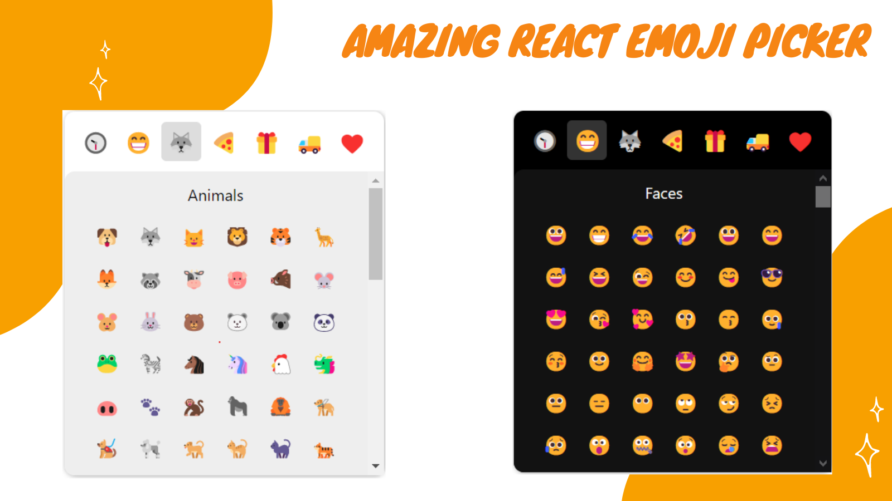

# Amazing React Emoji Picker

An amazing react emoji picker with more than 500 emojis included in the package.



<br />

## Install

```console
#npm
npm install amazing-react-emojipicker

#yarn
yarn add amazing-react-emojipicker
```

<br />

## Usage basic

```js
import { useRef, useState } from 'react';
import AmazingEmojiPicker from 'amazing-react-emojipicker';

const TestComponent = () => {
  const inputRef = useRef();
  const [toggle, setToggle] = useState(false);

  return (
    <div>
      {/* input field that emojis will be added to*/}
      <input type="text" ref={inputRef} />

      {/*Emoji picker component*/}
      <AmazingEmojiPicker
        darkMode={true}
        ref={inputRef}
        visibility={toggle}
        setVisibility={setToggle}
        top={10}
        left={20}
      />

      {/*emoji icon to open and close the picker*/}
       setToggle(!toggle)} />
    </div>
  );
};

export default TestComponent;
```

<br />

## Props details

| Prop            | Required | Description                                                |
| :-------------- | :------: | :--------------------------------------------------------- |
| `darkMode`      |    ✓     | Set the default theme to dark mode.                        |
| `ref`           |    ✓     | Ref of the input which emojis will be added in. (`useRef`) |
| `visibility`    |    ✓     | The initail visibility of the picker.                      |
| `setVisibility` |    ✓     | Toggle the picker by the set function of `useState`.       |
| `top`           |          | Set the top position of the picker.                        |
| `right`         |          | Set the right position of the picker.                      |
| `left`          |          | Set the left position of the picker.                       |
| `bottom`        |          | Set the bottom position of the picker.                     |

## License

[MIT](./LICENSE)
